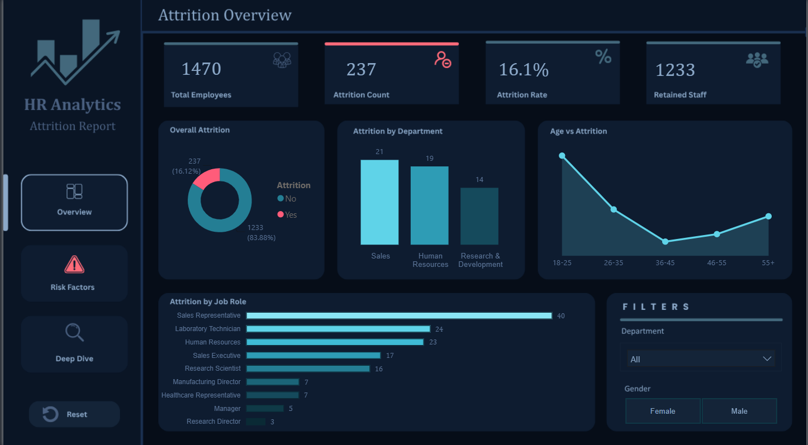
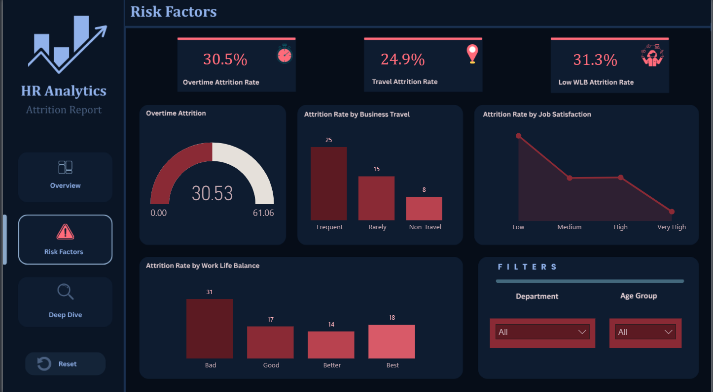
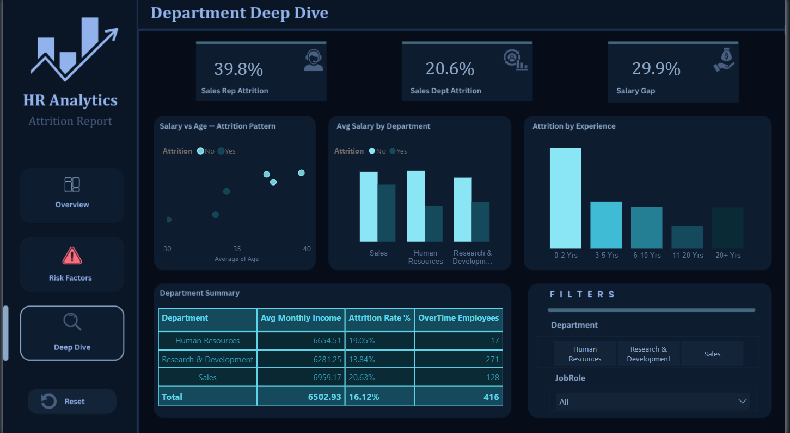

# HR Employee Attrition Analysis

## Overview
Why do employees leave? That's the question this project tries to answer.

Using Python and Power BI, I analyzed 1,470 employee records to find 
patterns in attrition — across departments, salary bands, job roles, 
and work conditions.

## Tools Used
- Python (Pandas, Matplotlib, Seaborn) — EDA & Data Cleaning
- Power BI — Interactive 3-page Report
- DAX — Custom measures and calculations

## Key Insights
- Sales Representatives are leaving at 39.7% — the highest of any role
- Overtime workers leave at 30.5% vs 10.4% for those who don't work overtime
- Employees who left were earning 29.9% less than those who stayed
- Frequent travelers leave at 24.9% vs 8% for non-travelers
- Low job satisfaction employees leave at 22.8% vs 11.3% for highly satisfied employees
- The 18-25 age group shows the highest attrition across all age groups

## Project Structure
- `HR_Attrition_Analysis.ipynb` — Python EDA notebook
- `HR_Attrition_Report.pbix` — Power BI Report
- `hr_attrition_clean.csv` — Cleaned dataset
- `Screenshots/` — Report screenshots

## Dashboard Preview

### Attrition Overview

### Risk Factors

### Department Deep Dive

